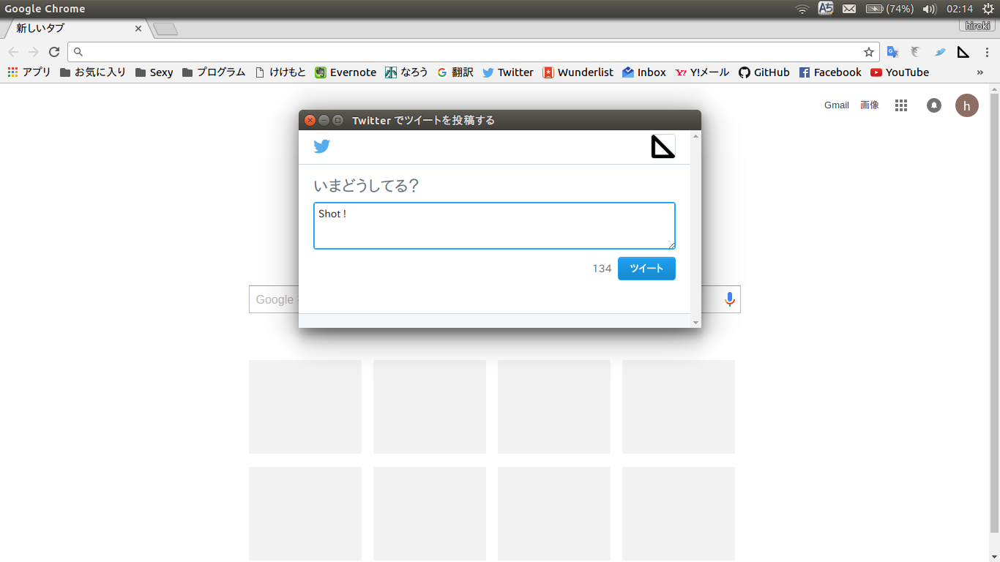

# Shot-Tweet

クリックひとつで、ツイート開始。Chromeの拡張機能です。

## Chromeに入れる方法

1. [ダウンロード](https://github.com/kekemoto/shot-tweet/archive/master.zip)します。
1. ダウンロードしたファイルはZipなので、展開します。
1. [メニュー]→[その他のツール]→[拡張機能]を開きます
1. 右上の[デベロッパーモード]をチェックします
1. [パッケージ化されていない拡張機能を読み込む...]を押します。
1. ダウンロードしたファイルを選択してください

### 小ネタ
キーボードショートカットからもツイートをShotできます。 
拡張機能の設定ページを開きまして、一番右下に[キーボードショートカット]があるのでそこから設定できます。

### Contact
[@nero1166](https://twitter.com/nero1166)

## Credit
[Click n' Tweet](https://raw.github.com/dciccale/click-n-tweet/master/LICENSE.txt)
