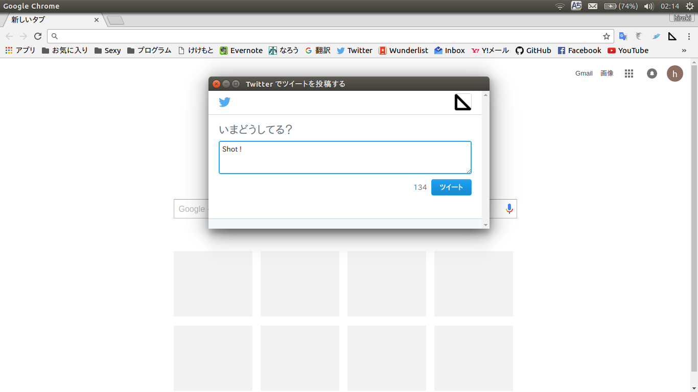

# Shot-Tweet

Only tweet in chrome

  

## Add to chrome

> git cloen https://github.com/kekemoto/shot-tweet.git

1. Open [chrome://extension](chrome://extension) in URL bar (or open up the Chrome menu by clicking the icon to the far right of the Omnibox:  The menu's icon is three horizontal bars. and select Extensions under the Tools menu to get to the same place). 
1. Check __developer mode__ in top right-hand corner. 
1. click __Load unpacked extension...__ to pop up a file-selection dialog.
1. select shot-tweet.

For more details, see [Load the extension](https://developer.chrome.com/extensions/getstarted#unpacked).

## contact
[@nero1166](https://twitter.com/nero1166)

## Credit
Fork from [Click n' Tweet](https://github.com/dciccale/click-n-tweet) : [license(MIT)](https://github.com/dciccale/click-n-tweet/blob/master/LICENSE.txt)

## License
[MIT](./LICENSE.txt)
